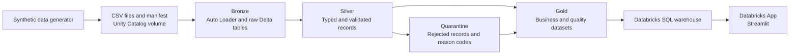

# Customer Insights on Azure Databricks

A utilities data engineering project that turns customer, invoice and payment records into reconciled receivables metrics and traceable data-quality results.

Built with **Azure Databricks, PySpark, Delta Lake and Unity Catalog**, the project includes a bronze–silver–gold pipeline and a **Streamlit application deployed through Databricks Apps**. It uses synthetic data throughout, with deliberately introduced defects to demonstrate how rejected records can be investigated without losing their source context.

## What it does

The project addresses two questions: **how much money is owed, and how reliable are the records behind those figures?**

- Ingests customer, invoice and payment CSV files using Auto Loader, with persistent checkpoints and source metadata.
- Validates identifiers, dates, amounts and relationships between entities; retains rejected records with reason codes.
- Calculates invoice balances, customer summaries, regional totals and invoice-month summaries.
- Provides a read-only application for exploring balances and investigating data-quality exceptions.

### Business Overview

Shows invoiced amounts, payments received, outstanding balances, overdue balances and collection rate. Users can filter customers by region, search by ID or name, inspect invoice details and export matching records to CSV.

### Data Quality

Shows record acceptance by source and validation failures by rule. Users can filter exceptions, inspect the original record and source file, and export the matching exceptions.

## Architecture



The tables sit in the `customer_insights_dev` catalog under the `bronze`, `silver` and `gold` schemas.

| Component                        | Role                                                         |
| -------------------------------- | ------------------------------------------------------------ |
| Unity Catalog volumes            | Store source files, the dataset manifest and ingestion state |
| Auto Loader                      | Discover and ingest available CSV files into bronze          |
| PySpark and Delta Lake           | Validate records, calculate balances and publish tables      |
| Unity Catalog permissions        | Control access to the catalog, schemas and tables            |
| Databricks SQL warehouse         | Execute application queries against gold tables              |
| Streamlit, pandas and Altair     | Present metrics, charts, filters and record details          |
| Databricks SDK and SQL connector | Authenticate using the app identity and query the warehouse  |

## Demo data and expected results

The `demo_v1` dataset uses **seed 42** and a fixed reference date of **4 October 2026**. Invoices cover July–September 2026. Customer names and email addresses are synthetic; the dataset contains no real customer information.

| Source    | Raw records | Accepted records | Excluded records |
| --------- | ----------: | ---------------: | ---------------: |
| Customers |      10,025 |           10,000 |               25 |
| Invoices  |      30,050 |           30,000 |               50 |
| Payments  |      27,030 |           27,000 |               30 |
| **Total** |  **67,105** |       **67,000** |          **105** |

The generator includes five defect scenarios:

| Scenario                                              | Expected exclusions |
| ----------------------------------------------------- | ------------------: |
| Duplicate customer IDs with identical business values |                  25 |
| Non-positive invoice amounts                          |                  30 |
| Invoices referencing unknown customers                |                  20 |
| Non-positive payment amounts                          |                  15 |
| Payments referencing unknown invoices                 |                  15 |

After validation, the expected financial results are:

| Metric                  | Expected value |
| ----------------------- | -------------: |
| Invoiced                |  £3,601,044.51 |
| Payments received       |  £3,064,180.59 |
| Outstanding             |    £536,863.92 |
| Overdue                 |    £536,863.92 |
| Collection rate         |         85.09% |
| Fully paid invoices     |         24,000 |
| Partially paid invoices |          3,000 |
| Unpaid invoices         |          3,000 |

Outstanding represents receivables, not proven revenue loss. Overdue means an outstanding balance whose due date is before the reference date. Monthly payment totals are allocated to the invoice's issue month, so the monthly chart represents invoice cohorts, not cash flow.

## Repository structure

```text
azure-databricks-customer-insights/
├── app/
│   ├── app.py                   # Streamlit screens and interaction
│   ├── data_access.py           # Warehouse queries and snapshot checks
│   ├── presentation.py          # Formatting, filtering and CSV helpers
│   ├── app.yaml                 # App launch command and resource reference
│   └── requirements.txt         # Pinned application dependencies
├── notebooks/
│   ├── 00_setup_customer_insights.ipynb
│   ├── 01_generate_demo_data.py
│   ├── 02_ingest_bronze.py
│   ├── 03_build_silver.py
│   └── 04_build_gold.py
├── sql/
│   └── 05_grant_app_access.sql.dbquery.ipynb
└── README.md
```

The `.py` notebooks use Databricks notebook source format. The setup notebook and permission query are stored as notebook exports; the permission query's `.dbquery.ipynb` suffix reflects its Databricks export format.

## Run the project

### 1. Prepare the workspace

Use an Azure Databricks workspace with Unity Catalog, serverless notebook compute, a SQL warehouse and Databricks Apps available. Databricks Apps requires a Premium workspace. The Python notebooks in this repository declare serverless environment version 6.

The account running the pipeline needs permission to create the project catalog, schemas, volumes and tables, or equivalent access to objects provisioned by an administrator.

Clone this repository into a Databricks Git folder. Open the notebooks from that folder. The project uses `customer_insights_dev` as its catalog name; update the setup notebook, pipeline constants, application constants and grants together if you choose another name.

### 2. Execute the pipeline

Run the notebooks in this order, waiting for each to finish successfully:

| Order | Notebook                                                         | Result                                                                 |
| ----- | ---------------------------------------------------------------- | ---------------------------------------------------------------------- |
| 00    | [Set up the catalog](notebooks/00_setup_customer_insights.ipynb) | Creates the catalog and three schemas                                  |
| 01    | [Generate demo data](notebooks/01_generate_demo_data.py)         | Writes CSV fixtures and a manifest with checksums and expected results |
| 02    | [Ingest bronze](notebooks/02_ingest_bronze.py)                   | Appends raw records with ingestion and source metadata                 |
| 03    | [Build silver](notebooks/03_build_silver.py)                     | Publishes accepted records, quarantine and quality summaries           |
| 04    | [Build gold](notebooks/04_build_gold.py)                         | Publishes reconciled business and quality datasets                     |

Source files are written to:

```text
/Volumes/customer_insights_dev/bronze/landing/demo_v1
```

Auto Loader schemas and checkpoints are kept separately in the `bronze.ingestion_state` volume. Notebook 02 uses `AvailableNow`: it processes available files and stops. Rerun it with unchanged sources to check that no additional rows are ingested. Preserve the checkpoints and target tables together.

### 3. Check the published data

Select your SQL warehouse in SQL Editor and run:

```sql
SELECT customer_count, invoice_count, invoiced_gbp,
       received_gbp, outstanding_gbp, overdue_gbp,
       collection_rate_pct
FROM customer_insights_dev.gold.business_overview;

SELECT entity, source_rows, accepted_rows, excluded_rows
FROM customer_insights_dev.gold.data_quality_summary
ORDER BY entity;
```

Compare the results with the baseline above. The gold schema contains eight application datasets:

| Table                     | Purpose                                                      |
| ------------------------- | ------------------------------------------------------------ |
| `invoice_balances`        | Invoice-level payments, balances, credits and payment status |
| `customer_summary`        | Customer-level totals and invoice counts                     |
| `regional_summary`        | Regional financial summaries                                 |
| `monthly_summary`         | Financial summaries by invoice issue month                   |
| `business_overview`       | Portfolio totals and headline metrics                        |
| `data_quality_summary`    | Source, accepted and excluded record counts                  |
| `data_quality_rules`      | Exclusion counts by validation rule                          |
| `data_quality_exceptions` | Rejected records, reason codes and source context            |

### 4. Deploy the application

1. Create a Databricks App, for example `customer-insights-dev`.
2. Add your SQL warehouse as an app resource with permission **Can use** and resource key **`sql-warehouse`**. This key must match `valueFrom` in [app.yaml](app/app.yaml).
3. Identify the app service principal's OAuth application/client ID. In the app's Environment tab, `DATABRICKS_CLIENT_ID` identifies the runtime credentials used by this implementation.
4. Open the [permission query](sql/05_grant_app_access.sql.dbquery.ipynb), copy its SQL into SQL Editor and replace every existing principal ID with your own app service principal's application/client ID. Run all grants as an owner or administrator with the required authority. The app needs `USE CATALOG`, `USE SCHEMA` and `SELECT` on the eight gold tables.
5. Give the app service principal **Can read** access to the source folder, then deploy the repository's **`app` folder**. Its launch configuration and dependencies are [app.yaml](app/app.yaml) and [requirements.txt](app/requirements.txt).
6. Open the app URL and check both Business Overview and Data Quality against the expected results.

Databricks provides the app's OAuth credentials at runtime; application code uses the SDK's `Config` object to authenticate. Keep client secrets and access tokens out of source files. App access and warehouse access are separate from Unity Catalog table permissions.

The application caches data for up to five minutes. Use **Refresh data** after publishing a new snapshot. For a small demo, use a small SQL warehouse with auto-stop configured, and stop the app when it is no longer needed.

## Validation and design choices

Checks are built into the pipeline notebooks:

- **Source integrity:** CSV headers and checksums must match the generator manifest before ingestion.
- **Record conservation:** accepted and quarantined records must account for every source record, with no overlap.
- **Relationships:** accepted invoices must reference accepted customers; accepted payments must reference accepted invoices.
- **Deterministic deduplication:** identical duplicate business records retain one accepted record. Conflicting values for a business key are quarantined.
- **Financial reconciliation:** invoice, customer, region, month and portfolio totals must reconcile. Payments are aggregated per invoice before joining, and money is calculated with decimal types.
- **Publication consistency:** silver and gold run IDs identify published snapshots. The application checks those IDs and refuses to display mixed publication versions.

Quarantined records retain their business key, source record ID, original payload, reason codes and ingestion metadata. A record may fail several rules; excluded-record counts count the record once.

### Common setup issues

| Symptom                                          | Check                                                                                                                        |
| ------------------------------------------------ | ---------------------------------------------------------------------------------------------------------------------------- |
| App says its data connection needs configuration | Verify the `sql-warehouse` resource key, its `app.yaml` reference and the deployed folder                                    |
| Logs show `INSUFFICIENT_PERMISSIONS`             | Grant access to the application/client ID used by the running app; warehouse **Can use** alone does not grant catalog access |
| App reports a data update in progress            | Allow the serial pipeline run to finish, rerun a failed publication stage and refresh the app                                |
| Baseline assertions fail                         | Check the manifest, dataset version, source files and ingestion state before changing expected counts                        |

## Current scope and next steps

This version is a reproducible portfolio demonstration using one fixed dataset. Ingestion uses Auto Loader checkpoints, while silver and gold are rebuilt as snapshots. Baseline assertions intentionally expect the original `demo_v1` data, so adding arbitrary new batches requires extending the validation model.

Delta writes are atomic per table, not across the entire publication. Run the notebooks serially. The application checks publication versions, but it does not provide an atomic switch across all gold tables.

The app uses a shared service principal: authorised viewers see the same synthetic dataset. Per-user data policies, concurrent production runs, load testing, automated deployment and CI/CD are outside the current implementation. The app also loads summary datasets into pandas, so its current access pattern is suited to the demo's size.

The next development steps are to add a Databricks job with ordered tasks, package deployment with Declarative Automation Bundles, introduce versioned test fixtures and GitHub Actions checks, and add monitoring for pipeline failures and compute costs.

## References

- [Azure Databricks Auto Loader](https://learn.microsoft.com/en-us/azure/databricks/ingestion/cloud-object-storage/auto-loader/)
- [Unity Catalog privileges](https://learn.microsoft.com/en-us/azure/databricks/data-governance/unity-catalog/manage-privileges/)
- [Databricks Apps authorization](https://learn.microsoft.com/en-us/azure/databricks/dev-tools/databricks-apps/auth)
- [Databricks Apps SQL warehouse resources](https://learn.microsoft.com/en-us/azure/databricks/dev-tools/databricks-apps/sql-warehouse)
- [Databricks Apps deployment](https://learn.microsoft.com/en-us/azure/databricks/dev-tools/databricks-apps/deploy)
